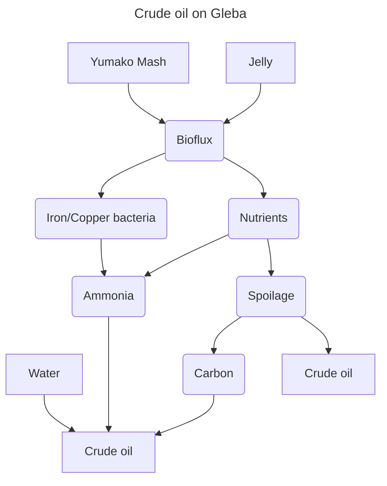
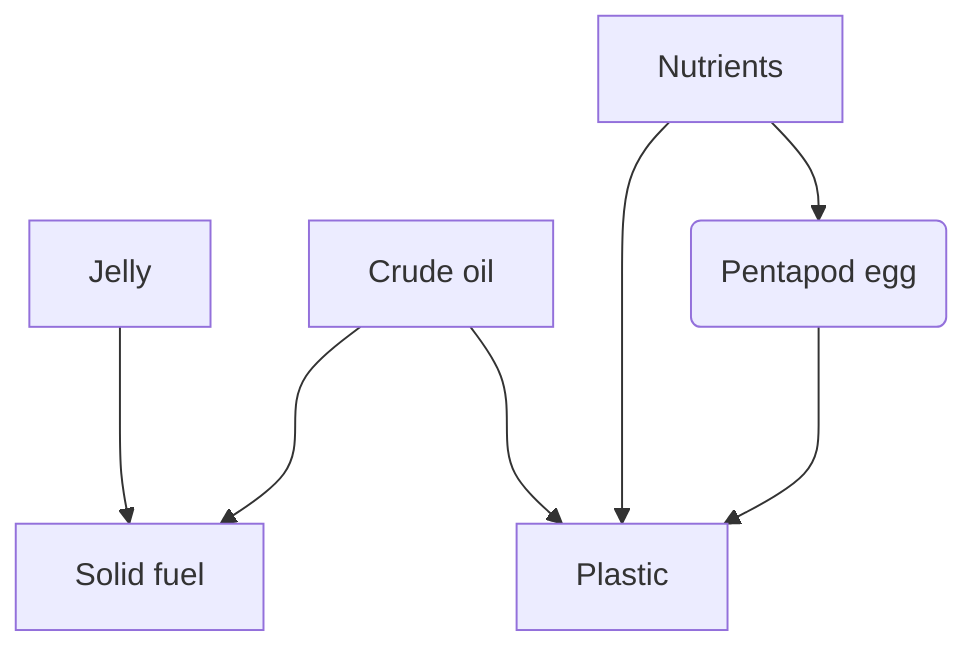

## Crude oil on Gleba

```mermaid
---
title: Crude oil on Gleba
---
flowchart TD
    A1[Yumako Mash] -->Bf(Bioflux)
    A2[Jelly] -->Bf
    H2o[Water] --> OilAm[Crude oil]
    Bf --> Ba(Iron/Copper bacteria)
    Bf --> Nu(Nutrients)
    Ba & Nu --> Am(Ammonia)
    Nu --> Sp(Spoilage)
    Sp --> Ca(Carbon)
    Ca & Am --> OilAm
    Sp --> OilSp[Crude oil]
```

## Direct uses crude oil on Gleba

_Excludes the ammonia + crude oil recipe as its unlocked on Aquilo_

```mermaid
flowchart TD
    Oil[Crude oil] ---> Pl[Plastic]
    Jl[Jelly] & Oil ---> SfJl[Solid fuel]
    Nu[Nutrients] --> Pp(Pentapod egg)
    Nu & Pp ---> Pl[Plastic]
```
