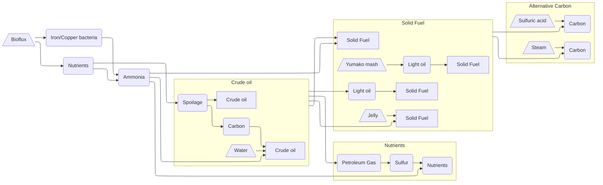

## Gleba Galore

```mermaid
---
config:
    flowchart:
        defaultRenderer: elk
---
graph LR
    Bf[/Bioflux\] --> Ba(Iron/Copper bacteria) & Nu(Nutrients)
    Ba & Nu --> Am(Ammonia)
    Nu --> Sp(Spoilage) --> Ca(Carbon)
    H2o[/Water\] & Ca & Am --> OilAm[Crude oil]
    Sp  --> OilSp[Crude oil]

    co --> Pg

    subgraph an[Nutrients]
        Pg(Petroleum Gas) --> Su(Sulfur)
        Nu2(Nutrients)
    end

    Am & Su --> Nu2

    subgraph asf[Solid Fuel]
        Lo(Light oil) --> Sfpg[Solid Fuel]
        Jl[/Jelly\] --> Sfoil[Solid Fuel]
        Sfam[Solid Fuel]
        Ym[/Yumako mash\] --> Loym(Light oil) --> Sflo[Solid Fuel]
    end

    co --> Sfoil
    co --> Lo
    Am & co--> Sfam

    subgraph co[Crude oil]
        OilSp[Crude oil]
        OilAm[Crude oil]
        H2o
        Ca
        Sp
    end

    subgraph aca[Alternative Carbon]
        Sa[/Sulfuric acid\] --> Ca2(Carbon)
        St[/Steam\] --> Ca3(Carbon)
    end
    asf --> Ca2 & Ca3
```
