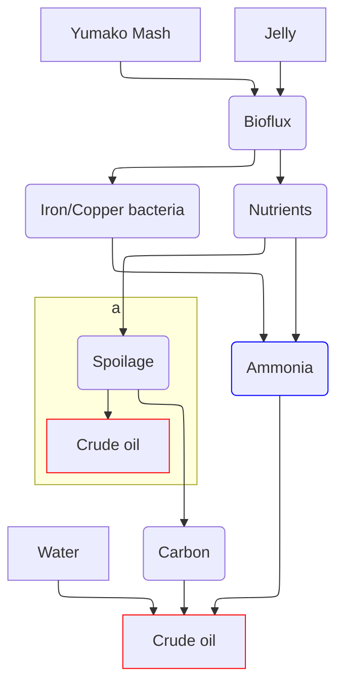

## Crude oil on Gleba

```mermaid
---
config:
    flowchart:
        defaultRenderer: elk
---
graph TB
    A1[Yumako Mash] -->Bf(Bioflux)
    A2[Jelly] -->Bf
    H2o[Water] --> OilAm[Crude oil]:::CrudeOil
    Bf --> Ba(Iron/Copper bacteria)
    Bf --> Nu(Nutrients)
    Ba & Nu --> Am(Ammonia):::Ammonia
    Nu --> Sp(Spoilage)
    Sp --> Ca(Carbon)
        Ca & Am --> OilAm
    subgraph a
        Sp --> OilSp[Crude oil]:::CrudeOil
    end

    classDef Ammonia stroke:#00f
    classDef CrudeOil stroke:#f00
```
