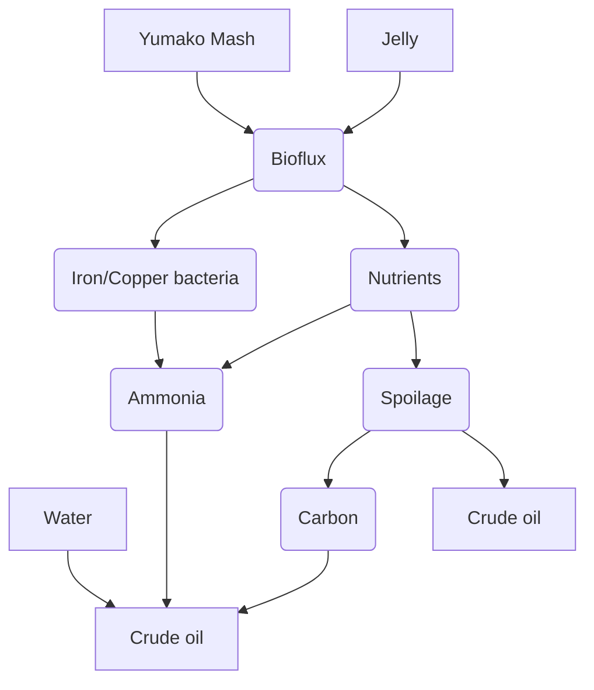

## Crude oil on Gleba

```mermaid
flowchart TD
    A1[Yumako Mash] -->Bf(Bioflux)
    A2[Jelly] -->Bf
    H2o[Water] --> OilAm[Crude oil]
    Bf --> Ba(Iron/Copper bacteria)
    Bf --> Nu(Nutrients)
    Ba & Nu --> Am(Ammonia)
    Nu --> Sp(Spoilage)
    Sp --> Ca(Carbon)
    Ca & Am --> OilAm
    Sp --> OilSp[Crude oil]
```
