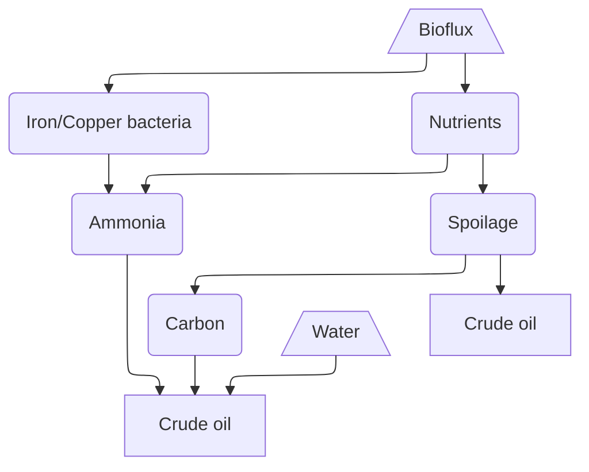

## Crude oil on Gleba

```mermaid
---
config:
    flowchart:
        defaultRenderer: elk
---
graph TB
    Bf[/Bioflux\] --> Ba(Iron/Copper bacteria) & Nu(Nutrients)
    Ba & Nu --> Am(Ammonia)
    Nu --> Sp(Spoilage) --> Ca(Carbon)
    H2o[/Water\] & Ca & Am --> OilAm[Crude oil]
    Sp  --> OilSp[Crude oil]
```
