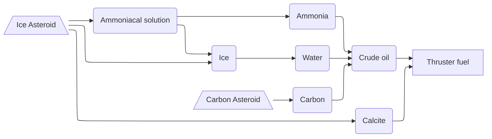
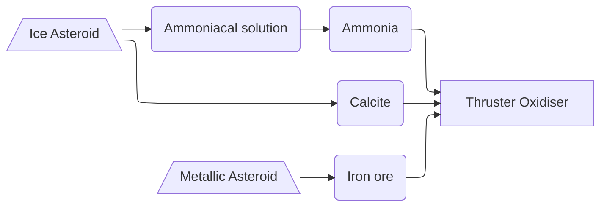
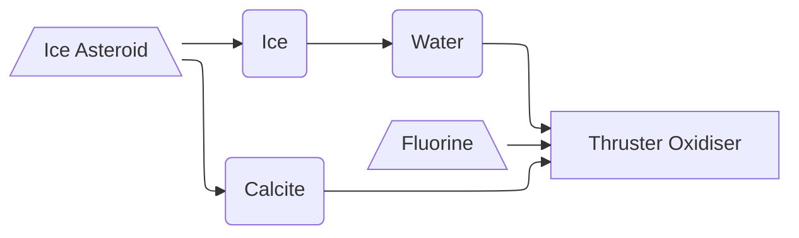
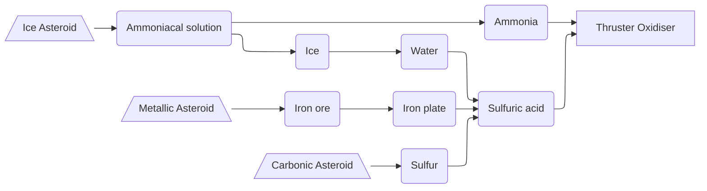

## Space fuel/ox

### Fuel[T3]

### Oxidiser[T3] (From Ammonia - Dinitrogen Tetroxide (N₂O₄))

### Oxidiser[T4] (From fluorine - Dioxygen Difluoride (O₂F₂))

### Oxidiser[T5] (From sulfuric acid - Nitric Acid)

