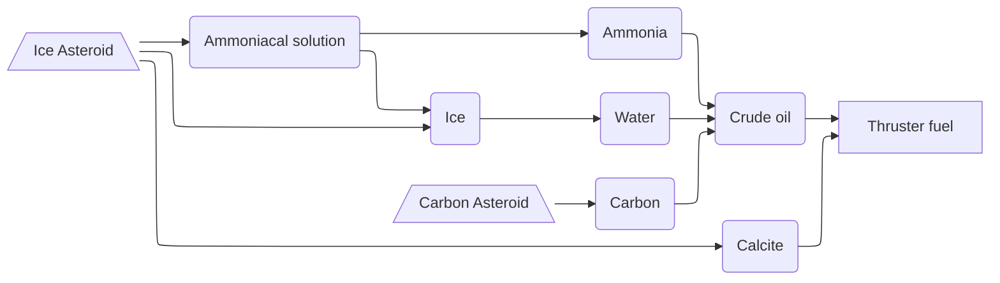
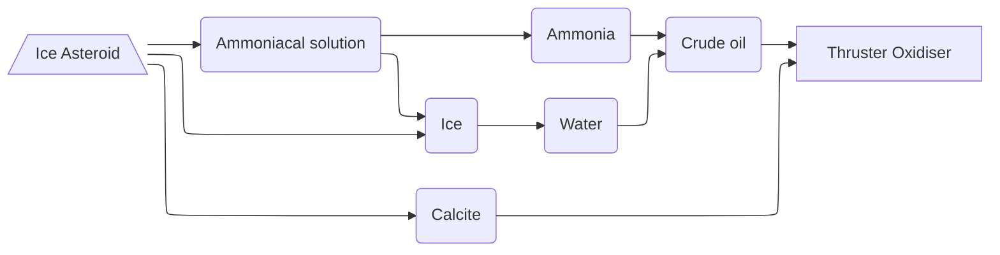

## Space fuel/ox

### Fuel

```mermaid
---
config:
    flowchart:
        defaultRenderer: elk
---
graph LR
    IceAs[/Ice Asteroid\] --> AmSo(Ammoniacal solution) --> Ice(Ice) & Am(Ammonia)
    Ice --> Wa(Water)
    CaAs[/Carbon Asteroid\] --> Ca(Carbon)
    Ca & Am & Wa --> Oil(Crude oil) --> Fuel[Thruster fuel]

    IceAs --> Ice
    IceAs --> Cal(Calcite) --> Fuel
```

### Oxidiser

```mermaid
---
config:
    flowchart:
        defaultRenderer: elk
---
graph LR
    IceAs[/Ice Asteroid\] --> AmSo(Ammoniacal solution) --> Ice(Ice) & Am(Ammonia)
    Ice --> Wa(Water)
    Am & Wa --> Oil(Crude oil) --> Ox[Thruster Oxidiser]

    IceAs --> Ice
    IceAs --> Cal(Calcite) --> Ox
```
