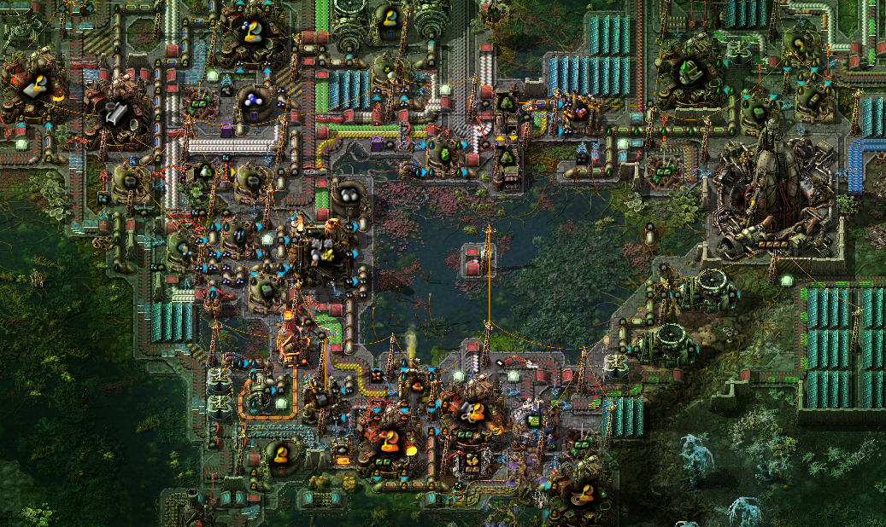

# Project Galore

A collection of mods focused on adding more recipes to the base game and Space Age.

## Current Installations

-   **[Vanilla Galore](https://mods.factorio.com/mod/vanilla_galore_continued)** (VGAL) - _(Core of the project)_ Adds a large amount of new recipes to the vanilla game.
-   **[Space Age Galore](https://mods.factorio.com/mod/space_age_galore)** (SAGAL) - Vanilla Galore support for Space Age, and 100+ new recipes.
-   **[Angel's Galore](https://mods.factorio.com/mod/angels_galore)** (AGAL) - Angel's Galore Adds a large amount of new recipes to Angel's mods.
-   **Angel's+Space Age Galore** (ASAGAL) - WIP. Combines Angel's and Space Age Galore.

## Suggestions

Please create a discussion thread on the modpage of the designied Galore entry if you have any recipe suggestions.
